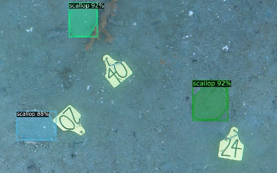
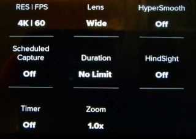

# Underwater orthophoto pipeline for scallop detection
## Tools for processing scallop imagery captured using GoPro cameras
This repo contains the pipeline for processing underwater imagery in to ortho-photos


## Contents
### General Usage
* [Capturing Images](#Capturing-Images)
* [Preparing GoPro Imagery](#Preparing-GoPro-Imagery)
* [Stitching with Metashape](#Stitching-with-Metashape)
* [Running Scallop Inference](#Running-Scallop-Inference)
* [Generating an online map](#Generating-an-online-map)

### Extending the detector
* [Uploading to Segments.ai](#Uploading-to-Segments.ai)
* [Downloading from Segments.ai](#Downloading-from-Segments.ai)
* [Training the Detector](#Training-the-Detector)

### Development
* [Developement Guide](#Developement-Guide)
* [Support](#Support)
---

## Capturing Images
Capturing video instead of images gives good temporal compression and allows for more images to be saved the using the timelapse option on the gopro. It also stores data from the onboard IMU at 200hz along with any GPS data that was received while above water. We are yet to explore the usefulness of this metadata.

The 3 most important settings for image capture:
* **Lens: _Wide_** - This allows for 4K60 capture. _Note: super-wide option is not useful due to the distortion around the edge of the frame._
* **RES|FPS: _4K|60_** - 4K works with Wide lens to save an image with no resizing. 60fps allows for longer recording than 30fps; so might as well use it.
* **HyperSmooth: _Off_** - Image stabilization makes camera calibration impossible.

Our complete GoPro settings are shown below.


---
## Preparing GoPro Imagery

GoPros split video into 4GB segments with the naming convention _GXAABBBB.MP4_, where _AA_ is the segment in sequence number and _BBBB_ is the video number. _This is unfortunate because if you order be filename the videos are organised by segment number and not video number._ 

Before feeding the imagery into metashape the frames need to be extracted from the videos. Metashape has a utility for this but it tends to be very slow. Using ffmpeg is a quicker approach.

In this example we have 3 videos labelled:

1. GX010121.MP4 _- Survey begins at 6m50s_
2. GX020121.MP4
3. GX030121.MP4 _- Survey ends at 5m30s_

To extract only the frames of interest we run the following commands:

```bash
# Create a new directory for images
mkdir images

# Extract frames after 6m50s in first video
ffmpeg -ss 00:06:50 -i GX010121.MP4 -q:v 2 -r 5 images/010121-%05d.jpg

# Extract all frames in middle video
ffmpeg -i GX020121.MP4 -q:v 2 -r 5 images/020121-%05d.jpg

# Extract frames before 5m30s in last video
ffmpeg -i GX020121.MP4 -t 00:05:30 -q:v 2 -r 5 images/030121-%05d.jpg
```
Parameters of note:
* `-q:v 2` - Specifies the jpg quality
* `-r 5` - Specifies extracted framerate (5fps) 

_**TODO:** It should be possible to extract the orientation from the GoPro stream and bake this into the metadata of the images. Can metashape use this without also having location data?_

## Stitching with Metashape
With the image preperation complete, metashape can be used to reconstruct the surveyed region.

Installing metashape's python package. The latest version can be found [here](https://www.agisoft.com/downloads/installer/).
```bash
wget https://s3-eu-west-1.amazonaws.com/download.agisoft.com/Metashape-1.7.2-cp35.cp36.cp37.cp38-none-win_amd64.whl
pip install Metashape-1.7.2-cp35.cp36.cp37.cp38-none-win_amd64.whl
```
Set the licence enviroment variable:
```bash
export agisoft_LICENSE=uclicense4p@5053
```
At UC we can use the floating license, otherwise a key can be provided instead.

With metashape setup we can run the reconstruction script:
```bash
python3 process-scan.py --full PROJECT_PATH 
```

## Running Scallop Inference

## Generating an online map 

---
## Uploading to Segments.ai

## Downloading from Segments.ai

## Training the Detector

---
## Developement Guide

## Support
Maintained by:
1. Josh McCulloch - josh.mcculloch@canterbury.ac.nz
